# カレンダー｜dreaMs 機能説明書

**株式会社グラスト ／ DX Solutions Division**
Phase 1（評価版）／ 2026-05-26 時点

---

## 本書について

本書は、社内のスケジュール共有システム「**カレンダー｜dreaMs**」（サイボウズ風の業務カレンダー）について、現時点で実装済みの画面と機能を、操作手順とともにご説明する資料です。

> **現状の位置づけ（重要）**
> 本バージョンは **Phase 1（評価版）** です。画面・操作感・デザインをご確認いただくための段階で、表示されているデータは動作確認用の**サンプルデータ**（社員名・予定など）です。
> - **実データベース連携**（実際の予定・社員データの保存）は次フェーズで対応します。
> - **Lark 本番ログイン**は、ログイン基盤までを実装済みで、認証情報の設定後に有効化します。
> 詳細は「9. 現状の位置づけと今後（ロードマップ）」をご覧ください。

---

## 1. システム概要

現場・案件のスケジュールを社内で一覧・共有し、担当者間の予定調整と当日の動きの把握を効率化するための業務用カレンダーです。

**主な特徴**

- 担当者別・日／週／月の切り替えで予定を一覧
- 予定を**種別（重要・現場・社内・社外 など）ごとに色分け**して直感的に把握
- 予定への**担当者の招待**と、**Lark への通知**連携
- スマートフォン向けの「今日の予定」簡易表示
- 当日の**日報**の提出・確認
- 予定種別やカレンダー表示範囲を管理する**管理機能**

**画面共通のヘッダー**

すべての画面の上部に共通ヘッダーがあり、左にシステム名、右に「今日の予定」「管理」、ログイン状態（利用者名・ログアウト）が表示されます。

---

## 2. ログイン（Lark アカウント連携）

社内で利用している **Lark アカウント**でログインします。

**操作手順**

1. ログイン画面で「**Lark でログインする**」を押します。
2. Lark の認可画面で許可すると、自動的にカレンダーへ移動します。

> Lark 本番ログインの有効化は次フェーズです（認証情報の設定後に動作します）。それまでは評価用として各画面をご確認いただけます。

---

## 3. カレンダー（メイン画面）

予定を **日 / 週 / 月** の 3 つの表示で確認できます。画面上部のタブで表示を切り替え、「<」「>」「今日」と日付欄で期間を移動します。担当者のチップで、表示する社員を絞り込めます。各予定をクリックすると予定詳細が開き、編集画面を経由せずに完了できます。

### 3.1 日表示

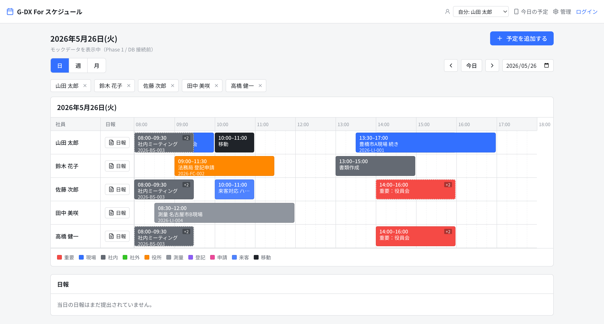

社員を縦軸、時間を横軸にしたタイムライン表示です。予定は種別の色で表示され、複数の担当者がいる予定には人数（例：+2）が付きます。予定詳細の「完了」では、作業終了時刻と作業メモを確認してから確定します。画面下部の凡例で色と種別の対応を確認できます。さらに下部には当日の**日報**欄があります。

### 3.2 週表示

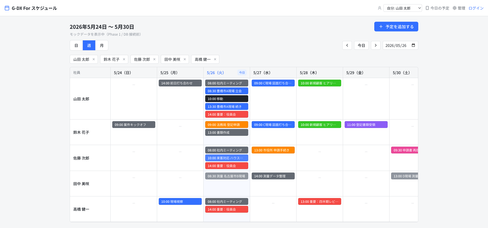

社員（縦）× 曜日（横）のマトリクスで 1 週間を俯瞰できます。当日の列が強調表示されます。

### 3.3 月表示

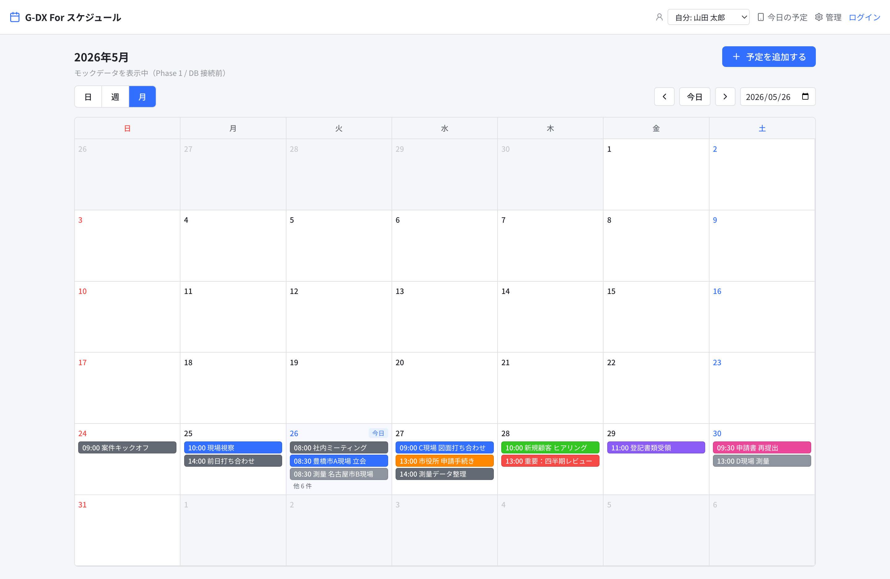

1 か月のカレンダーです。各日にその日の予定が並び、件数が多い日は「他 ◯ 件」と表示されます。当日が強調表示されます。

---

## 4. 予定の登録・編集

### 4.1 予定を新規登録する

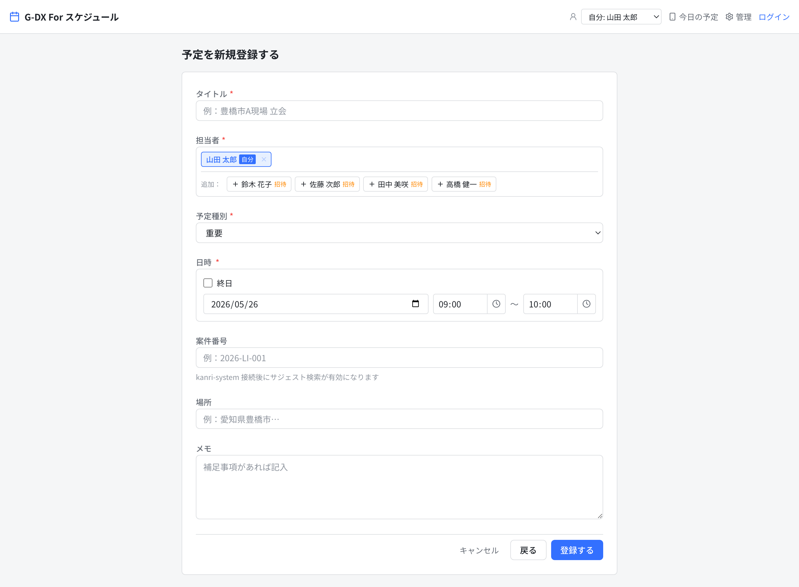

カレンダー右上の「**予定を追加する**」から登録します。

**入力項目**

| 項目 | 内容 |
|---|---|
| タイトル | 予定の件名（必須） |
| 担当者 | 自分を含め複数人を指定可能。追加した社員には Lark で**招待通知**を送れます |
| 予定種別 | 重要・現場・社内 などから選択（必須） |
| 会議URL | 予定種別がオンラインの場合に自動発行 |
| 日時 | 開始・終了。「終日」も指定可能（必須） |
| 案件番号 | 任意。kanri-system 連携後に**サジェスト検索**が有効になります |
| 場所・メモ | 任意の補足 |

**操作手順**

1. 各項目を入力します。
2. 「**登録する**」を押すと保存され、カレンダーに反映されます。

### 4.2 予定の詳細・編集

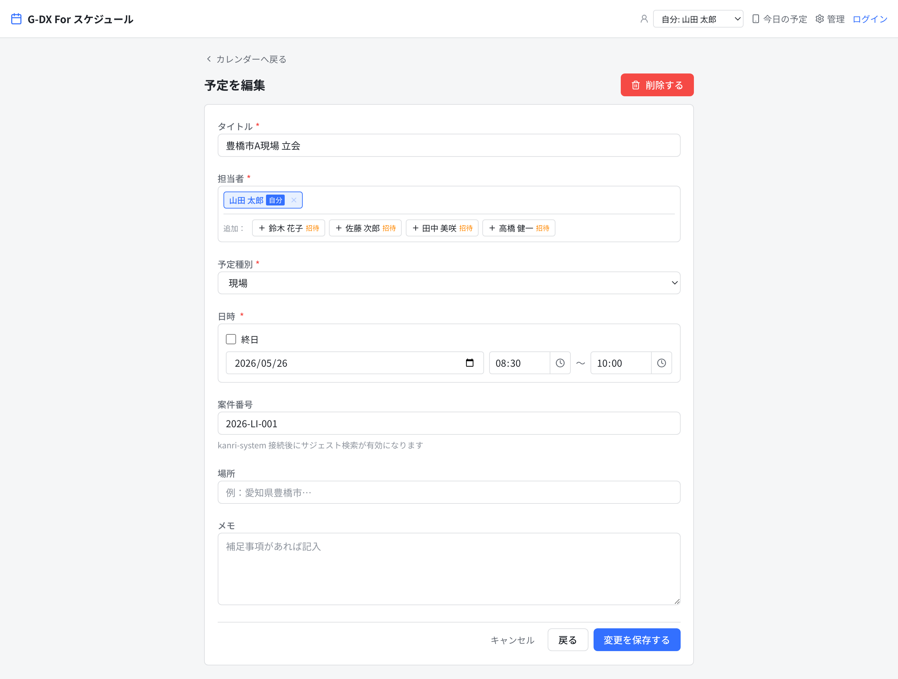

カレンダー上の予定をクリックすると編集画面が開きます。内容を修正して「**変更を保存する**」で更新、不要になった予定は「**削除する**」で削除します。

---

## 5. 今日の予定（スマートフォン向け簡易表示）

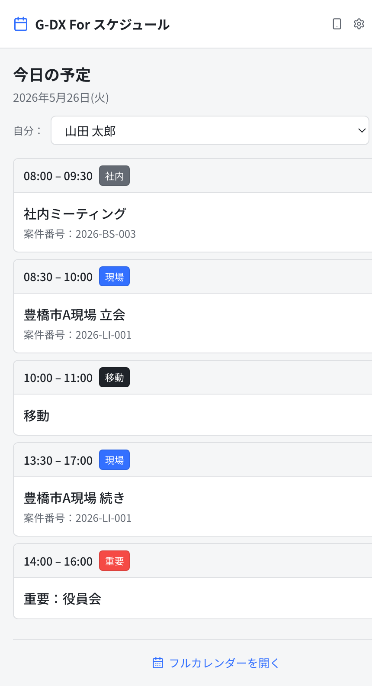

外出先での確認に適した、自分の当日の予定だけを時系列で並べたモバイル向け画面です。各予定に時間・種別・案件番号が表示され、「**フルカレンダーを開く**」から通常のカレンダーへ移動できます。

---

## 6. 日報

カレンダーの日表示の下部に、その日の日報欄があります。担当者が当日の業務内容を記録・提出でき、完了済み予定は日報内に自動で並びます。

作業時間（実施時間）は、予定より早く終わった場合または予定どおりの場合は青、予定より遅くかかった場合は赤の文字色で表示します。完了時に登録した作業メモも日報で確認できます。

提出時には Lark への通知連携にも対応しています（通知の有効化は Lark 連携設定後）。管理者は通知のボタンから該当日の該当日報へ直接移動し、コメントを返せます。

---

## 7. 管理機能

管理画面では、予定種別・社員・カレンダー表示・通知履歴を管理します。上部のタブで切り替えます。

### 7.1 予定種別マスタ

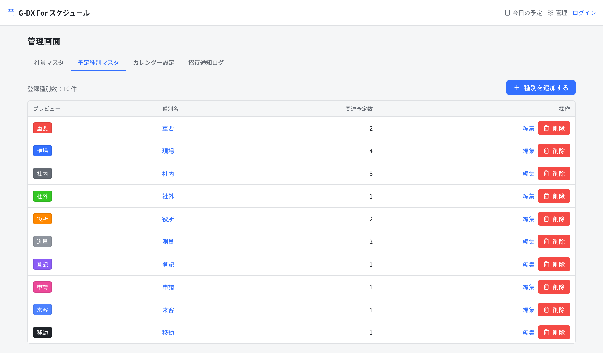

予定の種別（重要・現場 など）と、それぞれの**表示色**・関連する予定の件数を一覧で確認できます。

**色の選択（パレット）**

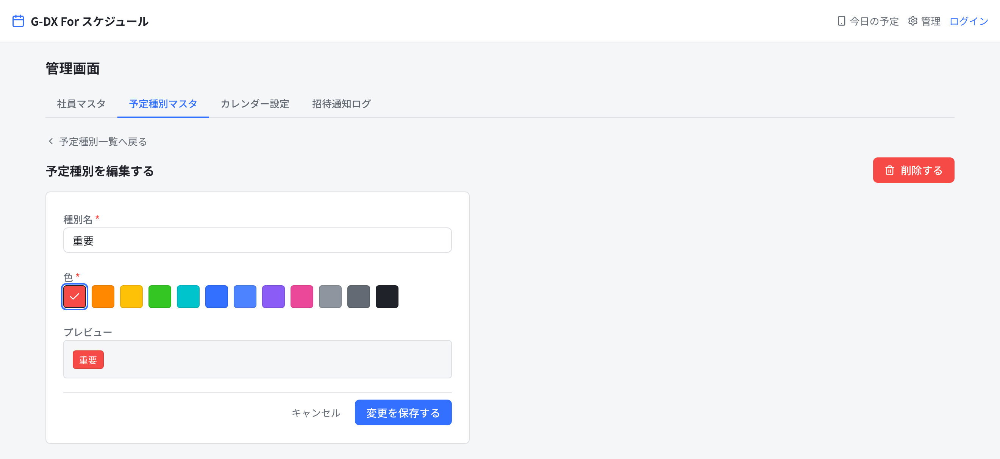

種別の追加・編集では、**12 色のパレットから色を選ぶだけ**で設定でき、選んだ色の見え方をその場でプレビューできます。ブランドに沿った色だけを使えるようにしているため、配色が散らからず、一覧性を保てます。

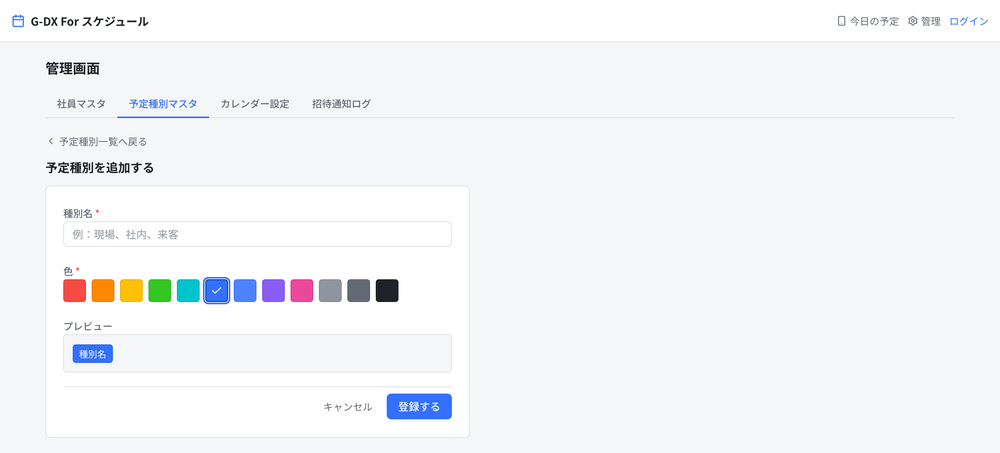

「種別を追加する」から新しい種別を登録できます。

### 7.2 社員マスタ（参照専用）

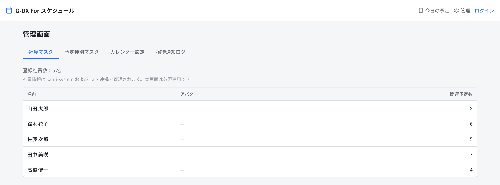

カレンダーに表示される社員の一覧と、各社員に紐づく予定件数を確認できます。社員情報は社内の基幹システム（kanri-system）および Lark 連携で一元管理するため、本画面は**参照専用**です。

### 7.3 カレンダー設定

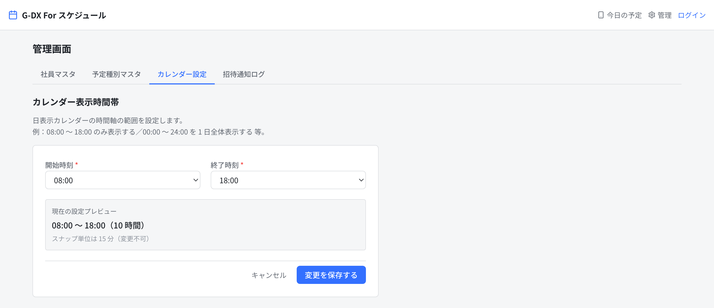

日表示カレンダーで表示する**時間帯の範囲**（開始・終了時刻）を設定します。現場の稼働時間に合わせて、見やすい範囲に調整できます。

### 7.4 招待通知ログ

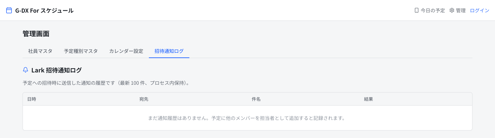

予定への招待や日報提出に伴って Lark へ送信した通知の**履歴**を確認できます。送信先・対象・送信可否がわかるため、連携状況の確認に利用できます。

---

## 8. デザイン方針

長期に使う業務システムとして、流行りの装飾ではなく「**現場が毎日使っても疲れない・迷わない**」ことを重視しています。

- **配色**：Lark ブルー（`#3370FF`）を基調に、白背景＋細い境界線で領域を区切る落ち着いた配色
- **形**：角丸は控えめ、影を多用せず、情報密度の高い業務向けレイアウト
- **文字**：日本語に最適化した Noto Sans JP を全面採用
- **一貫性**：ボタン・ステータス・色のルールを統一し、画面間で操作が揺れないように設計
- 過度なアニメーションや装飾を排し、**業務ツールとしての見やすさ・信頼感**を優先

---

## 9. 現状の位置づけと今後（ロードマップ）

### Phase 1（本評価版・実装済み）

- 全画面の UI と操作フロー（カレンダー日／週／月、予定登録・編集、今日の予定、管理機能、日報）
- 予定種別の色分け・色パレット
- Lark ログインの基盤（ログイン画面・ログイン状態の保護）
- Lark 通知連携の枠組み（招待・日報）
- ※ データは動作確認用のサンプル

### 次フェーズ（予定）

| 区分 | 内容 |
|---|---|
| データ連携 | 実データベース（Supabase）への接続。実際の予定・社員データの保存と共有 |
| 認証 | Lark 本番ログインの有効化（認証情報の設定・本番アカウント連携） |
| 基幹連携 | kanri-system の案件データ連携（案件番号のサジェスト検索 など） |
| 通知 | Lark への招待・日報通知の本番運用 |

> 本評価版で画面・操作感・デザインをご確認いただき、ご要望を反映したうえで、次フェーズの実データ連携・本番運用へ進めてまいります。

---

*本資料の画面はすべて評価用のサンプルデータを表示したものです。実際の運用データではありません。*
